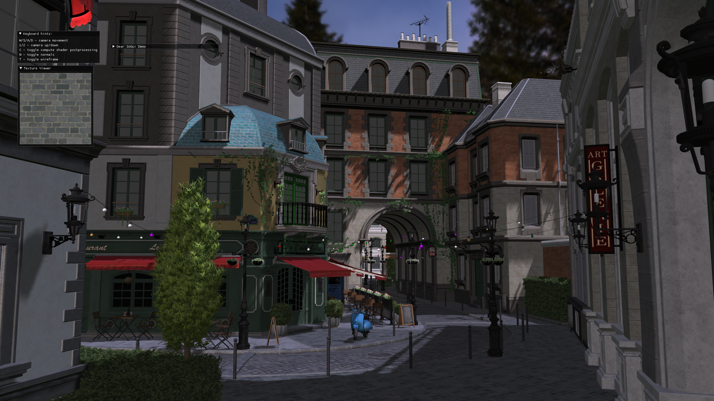
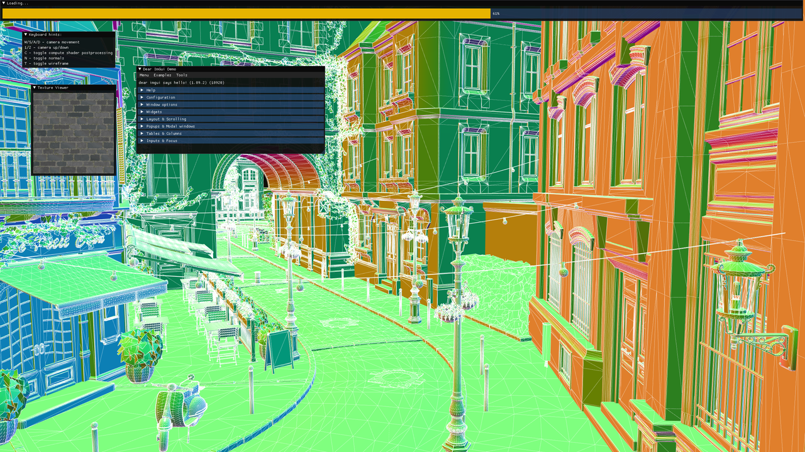

<div align="center">
  <picture>
    <source media="(prefers-color-scheme: dark)" srcset="https://github.com/facebook/igl/blob/main/.github/igl-full-color-white.svg?raw=true">
    <source media="(prefers-color-scheme: light)" srcset="https://github.com/facebook/igl/blob/main/.github/igl-full-color-black.svg?raw=true">
    
  </picture>

  [](https://github.com/facebook/igl/actions)

</div>

Intermediate Graphics Library (IGL) is a cross-platform library that commands the GPU. It encapsulates
common GPU functionality with a low-level cross-platform interface. IGL is designed to support multiple
backends implemented on top of various graphics APIs (e.g. OpenGL, Metal and Vulkan) with a common interface.

## Supported rendering backends

 * Metal 2+
 * OpenGL 2.x (requires [GL_ARB_framebuffer_object](https://registry.khronos.org/OpenGL/extensions/ARB/ARB_framebuffer_object.txt))
 * OpenGL 3.1+
 * OpenGL ES 2.0+
 * Vulkan 1.1 (requires [VK_KHR_buffer_device_address](https://registry.khronos.org/vulkan/specs/1.3-extensions/man/html/VK_KHR_buffer_device_address.html) and [VK_EXT_descriptor_indexing](https://registry.khronos.org/vulkan/specs/1.3-extensions/man/html/VK_EXT_descriptor_indexing.html))
 * WebGL 2.0

## Supported platforms

 * Android
 * iOS
 * Linux
 * macOS
 * Windows
 * WebAssembly

 ## API Support

|                          | Windows                    | Linux                      | macOS                         | iOS                           | Android                          |
| ------------------------ | -------------------------- | -------------------------- | ----------------------------- | ----------------------------- | -------------------------------- |
| Vulkan 1.1               | :heavy_check_mark:         | :heavy_check_mark:         | :heavy_check_mark: (MoltenVK) | :heavy_multiplication_x:      | :heavy_check_mark: (Quest 2/Pro) |
| OpenGL ES 2.0 - 3.0      | :heavy_check_mark: (Angle) | :heavy_check_mark: (Angle) | :heavy_check_mark:            | :heavy_check_mark:            | :heavy_check_mark:               |
| OpenGL ES 3.1 - 3.2      | :heavy_check_mark: (Angle) | :heavy_check_mark: (Angle) | :heavy_multiplication_x:      | :heavy_multiplication_x:      | :heavy_check_mark:               |
| OpenGL 3.1 - 4.6         | :heavy_check_mark:         | :heavy_check_mark:         | :heavy_multiplication_x:      | :heavy_multiplication_x:      | :heavy_multiplication_x:         |
| Metal 2                  | :heavy_multiplication_x:   | :heavy_multiplication_x:   | :heavy_check_mark:            | :heavy_check_mark:            | :heavy_multiplication_x:         |

## Build

Before building, run the deployment scripts:

```
python3 deploy_content.py
python3 deploy_deps.py

```

These scripts download external third-party dependencies. Please check [Dependencies] for the full list.

* Windows

```
cd build
cmake .. -G "Visual Studio 17 2022"
```

* Linux

```
sudo apt-get install clang xorg-dev libxinerama-dev libxcursor-dev libgles2-mesa-dev libegl1-mesa-dev libglfw3-dev libglew-dev libstdc++-12-dev
cd build
cmake .. -G "Unix Makefiles"
```

* macOS

```
cd build
cmake .. -G "Xcode" -DIGL_WITH_VULKAN=OFF
```

* iOS

```
cd build
cmake .. -G Xcode -DCMAKE_TOOLCHAIN_FILE=../third-party/deps/src/ios-cmake/ios.toolchain.cmake -DPLATFORM=SIMULATOR64
```


* Android

The Gradle project is located within the [build/android](./build/android/) folder.

## Screenshots





## License

IGL is released under the MIT license, see [LICENSE.md](./LICENSE.md) for the full text as well as third-party library
acknowledgements. SparkSL Compiler is released under the SparkSL Compiler License, see LICENSE.md for full text.
